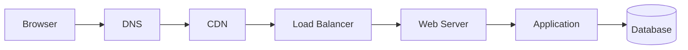
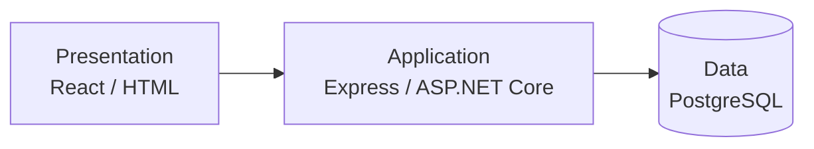
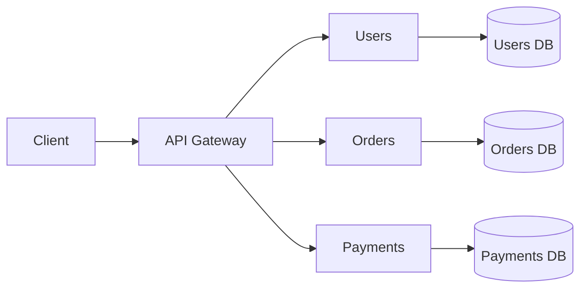
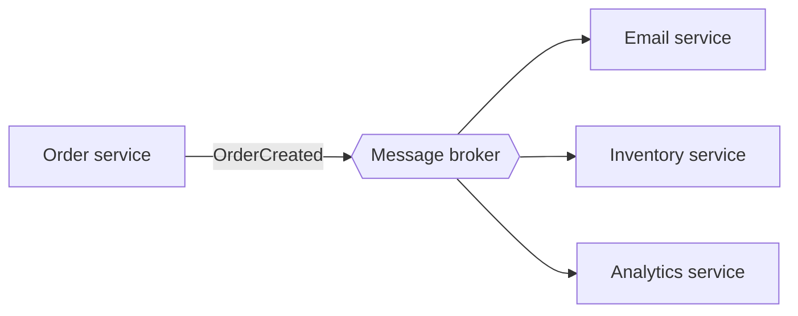
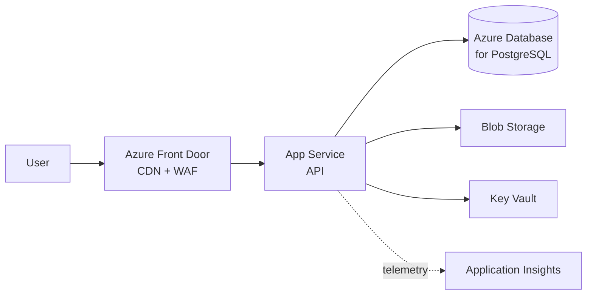
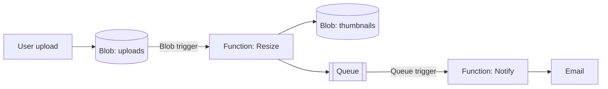
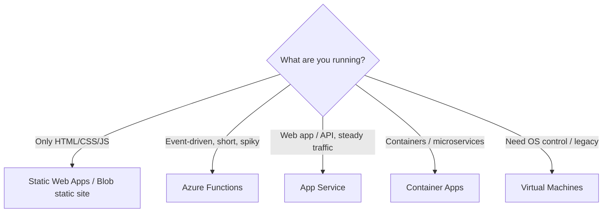

# Instructor Guide — Web Architectures, Cloud & Serverless

Not for Gamma. Demo code, diagrams (Mermaid), lab solution and troubleshooting.

## 1. Pre-class checklist

- Create the resource group and test every command the day before, using the **same region** students will use. Azure for Students subscriptions often have a policy restricting allowed regions; if `eastus2` fails with `RequestDisallowedByAzure`, try `centralus` or `westus2` and update the slides.
- Free App Service plans (F1) are limited per region and subscription. If a student hits the limit, use `--sku B1` and delete it at the end.
- Have Demo 1 and Demo 3 already deployed in a backup resource group in case the Wi‑Fi fails.
- Pre-install: Node.js 22, Azure CLI, Azure Functions Core Tools v4, VS Code + Azure Functions extension.

## 2. Diagrams (Mermaid)

Render at mermaid.live, export as PNG/SVG and drop into the matching Gamma card (or let Gamma's AI build a diagram from the arrow text already in the slide).

### Request journey (warm-up)


### N-Tier


### Microservices


### Event-driven


### Web app on Azure


### Serverless image pipeline


### Compute decision tree


## 3. Demo 1 — Express app (App Service)

`package.json`
```json
{
  "name": "webclass-demo",
  "version": "1.0.0",
  "main": "index.js",
  "scripts": { "start": "node index.js" },
  "dependencies": { "express": "^4.21.0" }
}
```

`index.js`
```javascript
const express = require('express');
const app = express();
const port = process.env.PORT || 3000;

app.get('/', (req, res) => {
  res.send(`<h1>Hello from ${process.env.WEBSITE_SITE_NAME || 'localhost'}</h1>`);
});

app.get('/api/health', (req, res) => {
  res.json({ status: 'ok', node: process.version, time: new Date().toISOString() });
});

app.listen(port, () => console.log(`Listening on ${port}`));
```

Talking points: `process.env.PORT` is injected by App Service; show **Configuration → Environment variables**, **Log stream**, and scaling options in the portal.

## 4. Demo 2 — Static site

Use any `index.html` + `404.html` (or the landing page from the HTML/CSS/Bootstrap worksheet). If `upload-batch` asks for permissions, add `--auth-mode key`.

## 5. Lab solution — Quotes API

`src/functions/quotes.js` (single file handling both methods keeps it short; students may split into two functions)
```javascript
const { app } = require('@azure/functions');

// In-memory on purpose: used to discuss statelessness
const quotes = [
  { text: 'Simplicity is prerequisite for reliability.', author: 'Edsger Dijkstra' },
  { text: 'First, solve the problem. Then, write the code.', author: 'John Johnson' },
  { text: 'Make it work, make it right, make it fast.', author: 'Kent Beck' }
];

app.http('quotes', {
  methods: ['GET', 'POST'],
  authLevel: 'anonymous',
  route: 'quotes',
  handler: async (request, context) => {
    if (request.method === 'GET') {
      const q = quotes[Math.floor(Math.random() * quotes.length)];
      return { jsonBody: q };
    }

    let body;
    try { body = await request.json(); }
    catch { return { status: 400, jsonBody: { error: 'Invalid JSON' } }; }

    if (!body?.text || !body?.author) {
      return { status: 400, jsonBody: { error: 'text and author are required' } };
    }

    quotes.push({ text: body.text, author: body.author });
    context.log(`New quote added. Total: ${quotes.length}`);
    return { status: 201, jsonBody: { added: body, total: quotes.length } };
  }
});
```

Bonus timer `src/functions/quoteOfTheDay.js`
```javascript
const { app } = require('@azure/functions');

app.timer('quoteOfTheDay', {
  schedule: '0 */1 * * * *',
  handler: async (timer, context) => {
    context.log('Quote of the day: Keep it simple.');
  }
});
```

Front end test (`index.html`) — note CORS: in Azure, add the front-end origin in **Function App → API → CORS** (or `*` only for the class demo). Locally, run `func start --cors "*"`.
```html
<button id="btn">Get quote</button>
<p id="out"></p>
<script>
  const API = 'https://func-webclass-XX.azurewebsites.net/api/quotes';
  document.getElementById('btn').onclick = async () => {
    const r = await fetch(API);
    const q = await r.json();
    document.getElementById('out').textContent = `"${q.text}" — ${q.author}`;
  };
</script>
```

Test with curl:
```bash
curl http://localhost:7071/api/quotes
curl -X POST http://localhost:7071/api/quotes -H "Content-Type: application/json" \
  -d '{"text":"Talk is cheap. Show me the code.","author":"Linus Torvalds"}'
```

Expected discussion outcome: POSTed quotes disappear after scale-in/idle or appear inconsistently across instances → state must live in an external store.

## 6. Activity 1 — Reference answers

1. Course registration: N-Tier on PaaS **or** serverless backend — heavy seasonal spikes favor auto-scaling and pay-per-use.
2. Restaurant MVP: monolith (modular) on App Service — speed and simplicity.
3. Bank with 15 teams: microservices — team autonomy and independent deploys.
4. Purchase side effects: event-driven — one event, three independent consumers.

## 7. Quiz answers

1. Monolith — fastest to build and operate with a tiny team.
2. The cloud provider.
3. e.g., HTTP (REST API), Timer (nightly report), Blob (image resize), Queue (order processing).
4. Instances are ephemeral and can be many; memory isn't shared or persistent.
5. Blob Storage static website (or Static Web Apps free tier).

## 8. Troubleshooting

| Problem | Fix |
|---|---|
| `RequestDisallowedByAzure` | Region blocked by student policy — change `--location` |
| Storage/Function name taken | Names are global; add initials + digits, lowercase only for storage |
| `func` not found | Install Core Tools v4 and reopen the terminal |
| `--flexconsumption-location` not recognized | `az upgrade` (old CLI version) |
| Function returns 404 after deploy | Wait 1–2 min; run `func azure functionapp list-functions <name>` |
| CORS error in browser | Configure CORS on the Function App |
